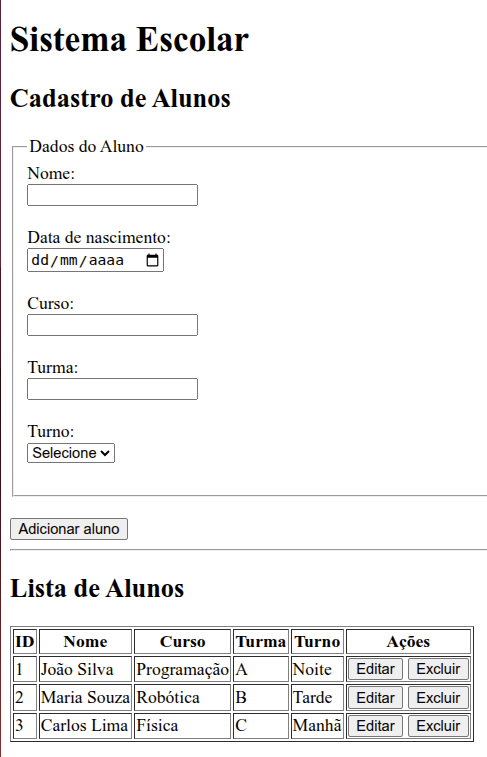
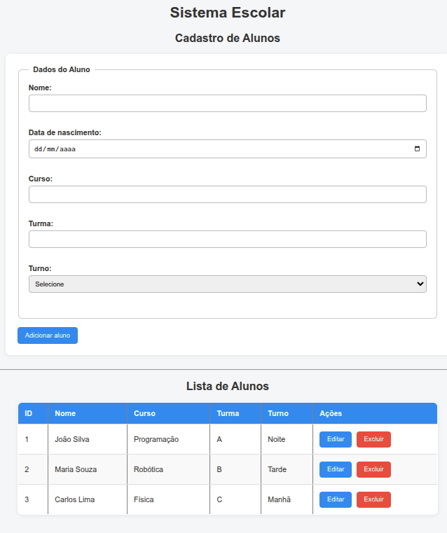
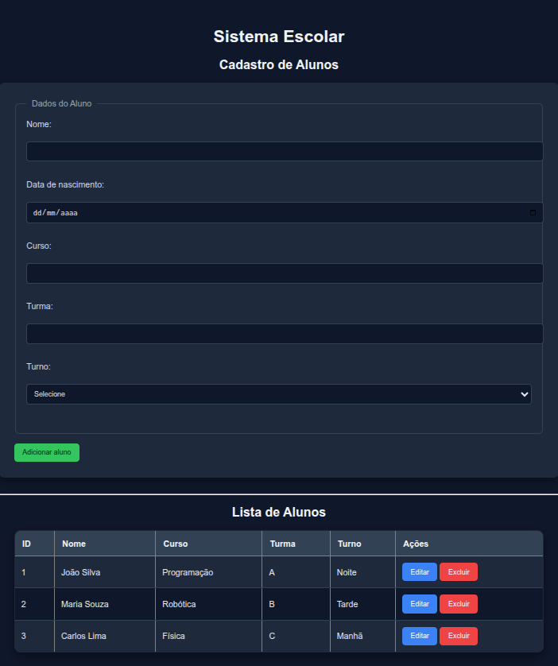
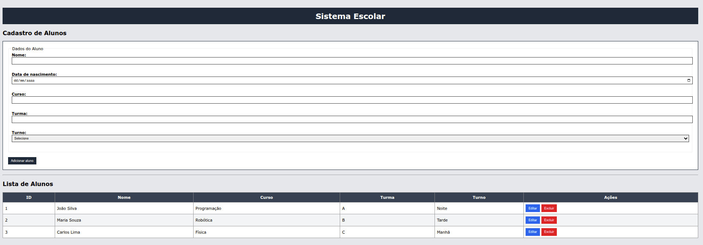
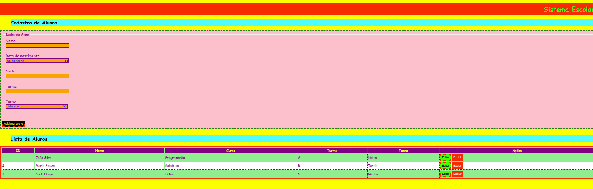
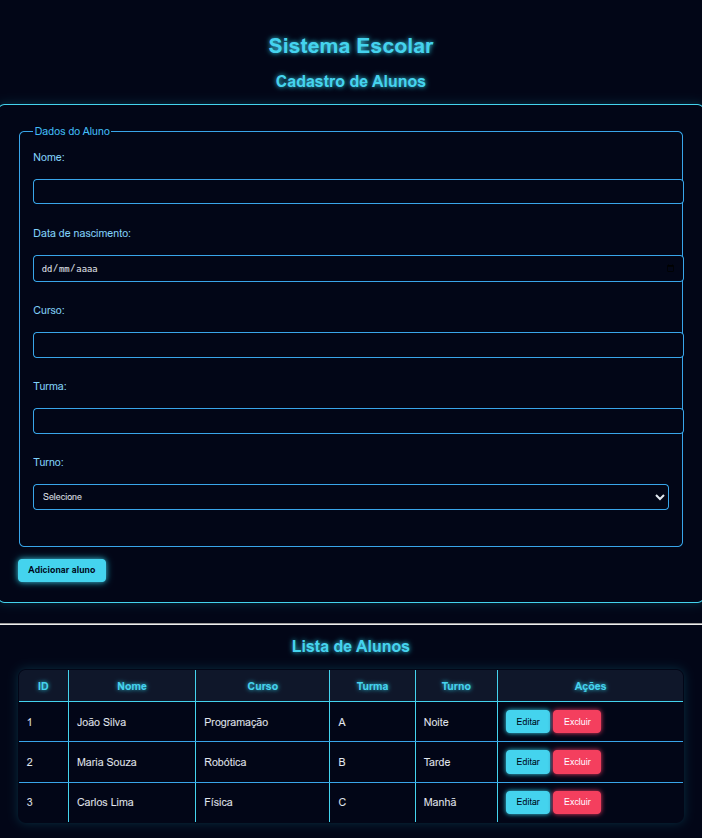
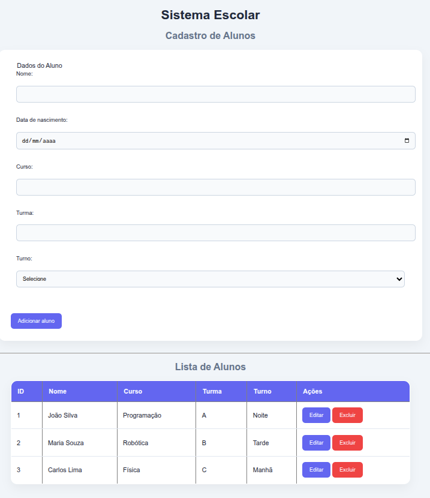

    # 💻 Aula - Estilizando um Sistema de Cadastro de Alunos

## 🎯 Objetivo

Nesta atividade, você vai transformar um HTML simples em uma interface visual mais organizada e agradável usando **CSS**.

O foco NÃO é backend nem JavaScript.  
O foco é **layout, organização e aparência**.

---

## 📁 Arquivo base

Você recebeu um arquivo HTML com:

- Um formulário de cadastro de alunos (parte de cima)
- Uma tabela com alunos cadastrados (parte de baixo)

⚠️ **NÃO altere a estrutura do HTML inicialmente.**
Pode adicionar classes ou ids para facilitar a estilização, mas mantenha a estrutura geral.
O desafio é trabalhar com CSS.

---

## 🧠 Desafio

Deixe o sistema com aparência mais profissional.

---

## ✅ Requisitos mínimos

Você deve implementar:

### 1. Estrutura geral
- Centralizar o conteúdo da página
- Definir uma largura máxima (ex: 800px ou 1000px)
- Melhorar a fonte (usar uma fonte mais moderna)

---

### 2. Formulário
- Colocar o formulário dentro de um "card"
- Adicionar:
  - espaçamento interno (padding)
  - borda ou sombra
- Organizar os inputs (não deixar tudo grudado)
- Inputs com:
  - largura consistente
  - espaçamento entre eles

---

### 3. Botão
- Estilizar o botão "Adicionar aluno"
- Alterar:
  - cor de fundo
  - cor do texto
  - cursor (pointer)
- Criar efeito ao passar o mouse (hover)

---

### 4. Tabela
- Melhorar visual da tabela:
  - Cabeçalho com cor diferente
  - Linhas alternadas (zebra)
- Adicionar espaçamento interno nas células
- Melhorar alinhamento dos textos

---

### 5. Botões da tabela
- Estilizar os botões "Editar" e "Excluir"
- Diferenciar por cor (ex: azul e vermelho)
- Adicionar hover

---

## 🚀 Desafios extras (opcional)

Se terminar rápido:

- Deixar o formulário e tabela com aparência de sistema real (tipo dashboard)
- Adicionar:
  - bordas arredondadas
  - sombras suaves
- Melhorar o espaçamento geral da página
- Destacar o título principal

---

## ❌ O que NÃO fazer

- Não usar frameworks (Bootstrap, Tailwind, etc.)
- Não usar JavaScript
- Não copiar código pronto da internet

---

## 💡 Dicas

- Use:
  - `margin` → espaço externo
  - `padding` → espaço interno
- Use seletores simples:
  - `form`
  - `input`
  - `button`
  - `table`
- Teste alterações pequenas e veja o resultado

---

## 🏁 Entrega

Entregar o arquivo:

- `index.html`
- `style.css`

---

## 🔥 Objetivo final

Transformar isso 👇
(HTML simples)

Em algo que pareça um sistema real 😎

---

Boa sorte! 🚀

---

Aqui seguem alguns exemplos de como o CSS altera o visual da página:

